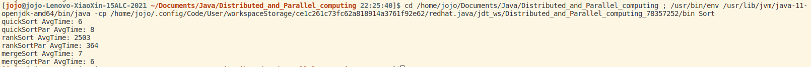
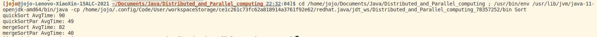
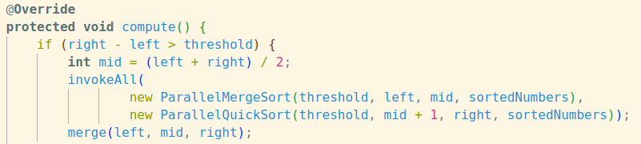
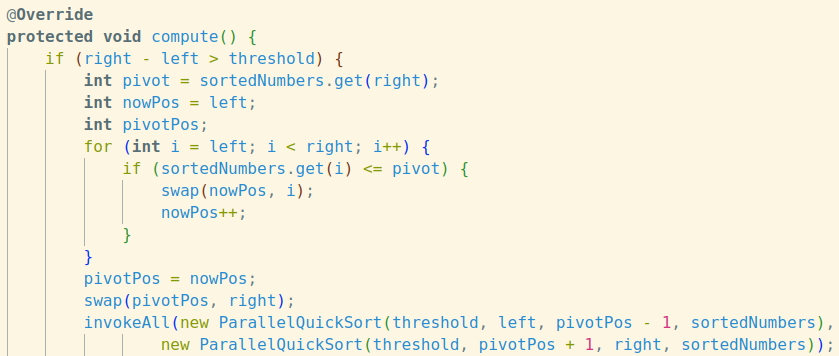
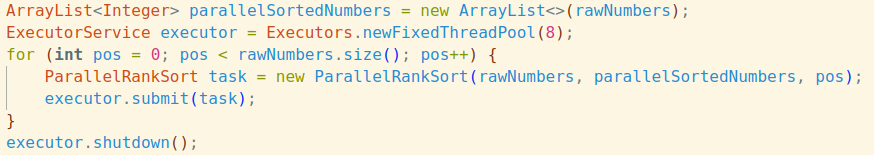
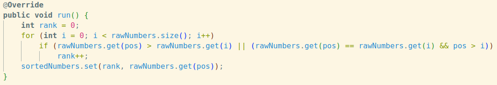
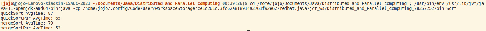

# 分布式与并行计算课程项目实验报告
<div style="text-align: right; font-size: 20px;">
<strong>——三种排序算法的串行与并行比较</strong>
</div>

## 一、实验环境
- 操作系统： 
Distributor ID: Ubuntu; Description: Ubuntu 22.04.3 LTS; Release: 22.04; Codename: jammy
- 处理器：
架构: x86-64; 型号: AMD Ryzen 7 5700U with Radeon Graphics; 每个核的线程数: 2; 每个座的核数:8
- 开发环境：
Openjdk: 11.0.20.1; 编辑器: VsCode; 插件: Extension Pack for Java v0.25.15

## 二、文件IO
`input/`文件夹下的`random30_000.txt`文件是课程主页提供的数据集，一共有**30,000**个乱序数据，数据范围是`[-50000, 50000]`，数据间以空格" "分隔。

`input/`文件夹下`random300_000.txt`文件是本人自己生成的数据集，一共有**300,000**个乱序数据，数据范围是`[-500000, 500000]`，数据间以空格" "分隔。

`output/`文件夹下形如`order*.txt`文件是对课程主页上提供的数据集的排序结果，从`order1.txt`到`order6.txt`依次是快速排序串行、并行；枚举排序串行、并行；归并排序串行、并行的排序结果。

`output/`文件夹下形如`orderNew*.txt`文件是对自己生成的数据集的排序结果，从`orderNew1.txt`到`orderNew6.txt`依次是快速排序串行、并行；归并排序串行、并行的排序结果。

## 三、算法伪代码
### 3.1 快速排序，串行运行
```Java
    Procedure quickSort(left, right)
        if left > right
            return;
        pivot = sortedNumbers[right];
        nowPos = left;
        for i = left to right
            if sortedNumbers[i] <= pivot
                swap(nowPos, i);
                nowPos++;
        pivotPos = nowPos;
        swap(pivotPos, right);
        quickSort(left, pivotPos - 1);
        quickSort(pivotPos + 1, right);
    end Procedure.
```
### 3.2 快速排序，并行运行
```Java
    Procedure quickSortParallel(left, right)
        if right - left > threshold
            pivot = sortedNumbers[right];
            nowPos = left;
            for (i = left; i < right; i++)
                if sortedNumbers[i] <= pivot
                    swap(nowPos, i);
                    nowPos++;
            pivotPos = nowPos;
            swap(pivotPos, right);
            invokeAll(
                new ParallelQuickSort(threshold, left, pivotPos - 1, sortedNumbers),
                new ParallelQuickSort(threshold, pivotPos + 1, right, sortedNumbers)
            );
        else 
            quickSort(left, right)
    end Procedure.
```
### 3.3 枚举排序，串行执行
```Java
    Procedure rankSort()
        for i = 0 to rawNumbers.length
            rank = 0;
            for j = 0 to rawNumbers.length
                if rawNumbers[i] > rawNumbers[j]
                    rank++
                else if rawNumbers[i] = rawNumbers[j] and i > j
                    rank++;
            sortedNumbers.set(rank, rawNumbers.get(i));
    end Procedure.
```
### 3.4 枚举排序，并行执行
```Java
    Procedure rankSortParallel()
        n = rawNumbers.length;
        P0 send L to P1, P2, ..., Pn
        for all P_pos where 1 <= pos <= n para-do:
            rank = 0;
            for i = 0 to n
                if rawNumbers[pos] > rawNumbers[i]
                    rank++;
                else if rawNumbers[pos] = rawNumbers[i] and pos > i
                    rank++;
            sortedNumbers[rank] = rawNumbers[pos]
    end Procedure.
```
### 3.5 归并排序，串行执行
```Java
    Procedure mergeSort(left, right)
        if left < right
            mid = (left + right) / 2
            mergeSort(left, mid)
            mergeSort(mid + 1, right)
            merge(left, mid, right)
    end Procedure.
```
### 3.6 归并排序，并行执行
```Java
    Procedure mergeSortParallel(left, right)
        if right - left > threshold
            mid = (left + right) / 2
            invokeAll(
                new ParallelMergeSort(threshold, left, mid, sortedNumbers),
                new ParallelMergeSort(threshold, mid + 1, right, sortedNumbers)
            );
        else 
            mergeSort(left, right)
    end Procedure.   
```

## 四、运行时间
### 4.1 使用random30_000.txt
使用课程主页上提供的数据集，调用上述排序算法进行10轮测试（共获得60组时间数据），每组数据取平均值，得到如下结果：



|  算法   | 串行运行时间(ms)  | 并行运行时间(ms)
|  ----  | ----  | ---- |
| 快速排序 | 6ms  | 8ms |
| 枚举排序 | 2503ms | 364ms |
| 归并排序 | 7ms | 6ms |

由上表可以看出，对于效率较高的排序算法（快速排序、并行排序的时间复杂度为`O(nlogn)`），串行和并行运行所需要的时间并未产生明显差异。我想可能的原因有以下两点：

- 由于数据量较少，导致未能充分发挥并行计算的优势；
- 考虑多线程在单核处理器中由于线程切换等操作所产生的并行开销，与计算开销相比不能忽视。

鉴于此，甚至会出现并行运行时间高于串行运行时间的情况。因此在之后的实验中，我计划加大待排序数据集的数据量，再次进行实验。

而对于枚举排序来说，由于算法本身效率较低，在面对该数据集时串行计算和并行计算的效率差异已经比较显著。考虑到在`Sort.java`中我将线程池中能够同时运行的线程个数设置为`8`，即`ExecutorService executor = Executors.newFixedThreadPool(8)`，而根据上表，枚举排序中并行运行时间比串行运行时间短了将近`7`倍，这个结果是和预期符合地比较好的。

### 4.2 使用random300_000.txt
使用自己生成的数据集，调用快速排序串行、并行算法，归并排序串行、并行算法进行10轮测试，每组数据取平均值，得到如下结果：



|  算法   | 串行运行时间(ms)  | 并行运行时间(ms)
|  ----  | ----  | ---- |
| 快速排序 | 90ms  | 49ms |
| 归并排序 | 82ms | 40ms |

由上表可以看出，当数据量较大时快速排序和归并排序并行运算的时间还是显著短于串行运行的时间的。据此实验结果，可以验证使用`random30_000.txt`文件时的猜想。即数据量较小时，由于并行所额外产生的各种开销与计算开销相比不能忽视，串行算法和并行算法的效率相差无几，甚至有可能会导致出现并行运行时间高于串行运行时间的情况。然而当数据量很大时，计算开销将占据解决问题的开销的极大一部分，此时使用并行算法将大大提高解决问题的效率。

## 五、技术要点
### 5.1 Java多线程库
#### 5.1.1 线程池ForkJoinPool
在实现`ParallelMergeSort.java`和`ParallelQuickSort.java`的过程中，使用了Java线程池`ForkJoinPool`进行线程的管理，并继承了`RecursiveAction`类。`ForkJoinPool`是Java中的一个线程池实现，可用于执行分治任务。它的核心思想是将一个大任务拆分成多个小任务，然后将这些小任务分配给线程池中的工作线程进行并发执行，最后将各个小任务的执行结果进行合并。`RecursiveAction`是`ForkJoinPool`中用于执行没有返回值的分治任务的抽象类。通过重写`RecursiveAction`中的`compute`方法后，我们可以将一个大任务拆分成多个小任务并将这些小任务提交给 `ForkJoinPool`进行执行。

通过使用上述`API`，我们可以轻易维护好分治任务的线程优先级：分治任务线程树的叶子结点会首先上CPU运行，然后一层一层往上运行。在快速排序和归并排序的并行化设计中都运用到了此方法：


#### 5.1.2 线程池FixedThreadPool
在实现`ParallelRankSort.java`的过程中，使用了Java线程池`FixedThreadPool`进行线程的管理。`FixedThreadPool`是Java中的一个线程池实现，其中线程的数量是固定的。在创建`FixedThreadPool`时，可同时制定可同时执行的线程数量。通过该`API`，我们可以有效控制枚举排序并行计算时所能使用的线程数量，从而对枚举排序并行运行时间得到一个基本的预期。



### 5.2 Threshold——阈
在实现`ParallelMergeSort.java`和`ParallelQuickSort.java`的过程中，需要判断是否应该将问题继续划分成子问题或直接求解，也就是引入所谓“阈值”。若不设置阈值或阈值设置过小，会将问题几乎“无限”划分下去，产生巨量的子问题。在解决这些子问题的过程中，会出现频繁的线程切换和任务调度，降低并行计算的效率。而阈值设置过大，可能导致任务无法充分利用并行计算的优势，也会降低并行计算的效率。

在“运行时间”板块，快速排序和归并排序的阈值被设置为`2048`，即所需要处理的集合队列长度若超过`2048`，则继续划分子问题；若所需要处理的集合队列长度小于`2048`，则直接使用串行排序算法求解问题。即：
```Java
    @Override
    protected void compute() {
        if (right - left > threshold) {
            //继续划分子问题
        } else {
            //调用串行算法解决子问题
        }
    }
```
这个阈值是根据问题的特性和计算资源的情况，反复调参尝试，得到的较优结果。若阈值设置得不合理，例如过小，如2，则并行计算的效率将下降，如下表所示：

|  算法   | 串行运行时间(ms)  | 并行运行时间(ms), threshold = 2048
|  ----  | ----  | ---- |
| 快速排序 | 90ms  | 49ms |
| 归并排序 | 82ms | 40ms |

|  算法   | 串行运行时间(ms)  | 并行运行时间(ms), threshold = 2
|  ----  | ----  | ---- |
| 快速排序 | 87ms  | 65ms |
| 归并排序 | 79ms | 52ms |

## 六、优化

### 6.1 实验设计优化
由于一次排序的结果可能具有偶然性，因此我在实验中对每种排序方式进行了10轮测试并统计时间求平均。通过该方法获得的排序时间排除了偶然性，更加稳定和典型。

### 6.2 并行方法优化
通过合理设置Threshold阈值，充分发挥代码的并行优势，提高了并行计算的效率。

### 6.3 代码实现优化
因为`ArrayList<Integer>`要在`int`和`Integer`之间进行装箱和拆箱，而且 `Integer.get(i)`相较于`int[i]`的性能也会有点下降，因此执行较慢。若改为对`int[] list`进行排序，效率理应会提高。但是这应当不是本门课重点内容，且`ArrayList`中有很多好用的库函数，因此并未实现此优化。

另外在`ParallelMergeSort.merge`方法中，考虑是否每个合并操作可以由两个线程同时执行：一个线程从小到大进行选择写入目标数组队列，另一个线程从大到小进行选择写入目标数组队列。实现后发现效果并不理想，初步分析原因是该优化并未降低`merge`操作的时间复杂度，且需要`merge`的数组队列较短时得不偿失。

## 七、分析总结
### 7.1 快速排序和归并排序
根据前面所进行的项目实践，可以看出当待排序数据规模较小(30,000)时，快速排序和归并排序的串行算法和并行算法所需要的时间几乎相同，排序算法的并行化并未提高排序效率。经过分析，原因有以下几点：
- 在创建较多子线程后，JVM会花费大量资源用以管理线程，维护线程之间的通信等，产生额外的并行开销。

- 当数据量较小时，由于并行化产生的额外开销，相比于计算开销不可忽略，会影响并行计算的效率，甚至有可能会出现并行运行时间高于串行运行时间的情况。

- 同时快速排序和归并排序都属于分治任务，并行化设计时要考虑父任务与子任务的优先级，一定程度上也影响了并行计算的效率。

将数据规模加大（300,000）后，此时计算开销占据了解决问题的开销的极大一部分，使用并行算法大大提高了解决问题的效率。并行计算加速比由原来的**接近1**提升到了**接近2**。
|  算法   | 串行运行时间(ms)  | 并行运行时间(ms)
|  ----  | ----  | ---- |
| 快速排序 | 90ms  | 49ms |
| 归并排序 | 82ms | 40ms |

### 7.2 枚举排序
在数据规模较小（30,000）时，将枚举排序算法并行化已经起到了很好的效果。这是因为枚举排序从算法结构上就很适合通过并行实现：只需要把外层循环拆成需要并行的子任务即可，每个子任务分别对待排序队列进行遍历，求出该子任务需排序的数据的秩即可。在项目实践中，枚举排序并行计算加速比**接近7**，与实验中将线程池中能够同时运行的线程个数设置为8的设计符合得很好：

性能$E_p = \frac{S_p}{p} = \frac{7}{8}$，**接近1**。
|  算法   | 串行运行时间(ms)  | 并行运行时间(ms)
|  ----  | ----  | ---- |
| 枚举排序 | 2503ms | 364ms |

另外，若将将线程池中能够同时运行的线程个数设置为16（我的电脑是8核16线程的），性能并不如设置为8好。这可能是因为电脑中的线程不是只供给项目实验中的排序任务的，其他系统进程和应用程序也需要使用一部分线程来完成它们的工作。因此，将线程池中可同时运行的线程个数设置为16可能会导致线程竞争和资源争用，从而整个并行系统的性能。

### 7.3 总结
经过该项目实践，我认识到了并行系统的性能与待处理的数据集大小、并行化方法的设计以及系统硬件配置（可用的资源）等都有很大的关系。若待处理的任务数据集过小，则并行化方法难以发挥它的优势，甚至可能不如串行方法。而并行化方法的设计则决定了并行系统性能的上限，合理地进行线程管理、设置阈值等，是充分发挥并行系统优势，提高并行计算效率的必要条件。最后，在个人电脑上进行并行算法设计，也要考虑到主机可用的资源，包括CPU座数、核心数，核心上的线程数等。将系统硬件配置纳入并行化设计的考虑范畴，有助于提升所设计出的并行系统的性能。
